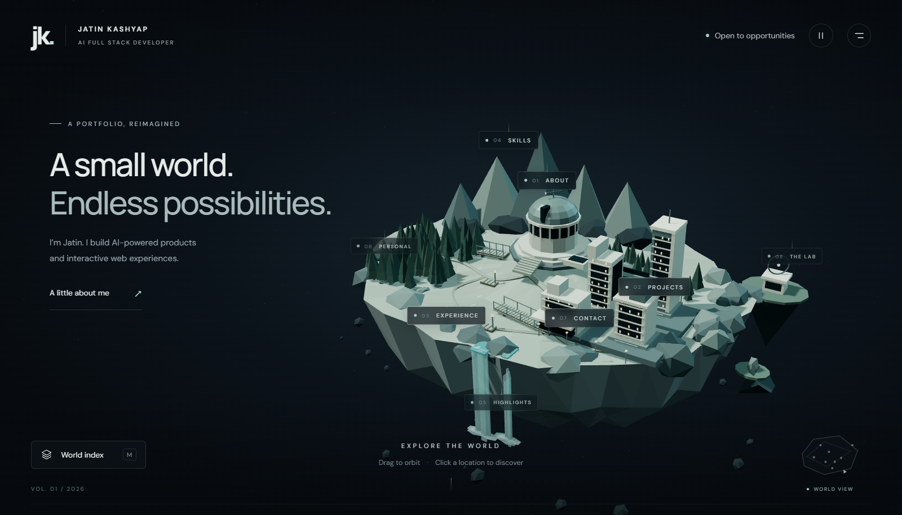

<div align="center">

# 🌍 Jatin Kashyap — A Small World

### *An explorable low-poly 3D portfolio island — navigate the world to discover everything about me.*

[](https://jk-3d-portfolio.deploylane.online/)
[](https://threejs.org/)
[](https://developer.mozilla.org/en-US/docs/Web/JavaScript)
[](https://www.khronos.org/webgl/)
[](https://jk-3d-portfolio.deploylane.online/)

</div>

---

## 📸 Preview



> **Drag to orbit · Click a location to explore · Press `M` for the world index**

---

## ✨ What is this?

This is not your average portfolio. It's a **handcrafted 3D floating island** where each section of the island *is* the navigation. No menus, no scrolling — just an explorable world.

Built entirely with **vanilla JavaScript + Three.js**. No React. No bundler. No build step. Just pure, performant 3D on the web.

---

## 🗺️ Explore the World

| 📍 Location | 🏛️ What's There |
|---|---|
| 🔭 **Observatory** | About me — who I am, what I do |
| 🏙️ **District** | Projects — MAYA AI, FORGE AI, CHESS AI, PIXELFORGE |
| 🌊 **River** | Experience — education & dev journey timeline |
| 🏔️ **Summits** | Skills — 5 capability groups & tech stacks |
| 💧 **Falls** | Highlights — degree & product-dev achievements |
| 🌳 **Grove** | Personal — creative interests & explorations |
| 🌉 **Bridges** | Contact — location, availability, links |
| 🛸 **Outer Islands** | The Lab — experimental directions |

---

## 🚀 Features

- 🏝️ **Procedural island** — fully authored geometry, no external 3D model files
- 🎥 **Smooth camera travel** — eased transitions between every destination
- 🖱️ **Drag orbit + zoom** — full pointer & touch control
- 🏷️ **3D-projected HTML labels** — real accessible buttons in 3D space
- 📱 **Responsive** — mobile bottom sheets, adjusted camera framing
- 🗺️ **Live minimap** — shows active landmark + camera heading
- ⭐ **Animated effects** — water, waterfalls, shooting stars, traffic light, antenna
- ♿ **Accessible** — keyboard navigation, focus states, reduced-motion support
- ⚡ **Performance-first** — adaptive quality, instanced geometry, no postprocessing
- 🛡️ **WebGL fallback** — full lightweight HTML fallback if WebGL fails

---

## 🔗 Routes

| URL | Destination |
|---|---|
| `/` | 🌍 World overview |
| `/#about` | 🔭 Observatory — About |
| `/#projects/maya` | 🤖 MAYA AI |
| `/#projects/forge` | 🔨 FORGE AI |
| `/#projects/chess` | ♟️ CHESS AI |
| `/#projects/pixelforge` | 🎨 PIXELFORGE |
| `/#experience` | 📅 Timeline |
| `/#skills` | 🛠️ Skills |
| `/#achievements` | 🏆 Highlights |
| `/#personal` | 🌳 Personal |
| `/#contact` | 📬 Contact |
| `/#lab` | 🛸 The Lab |

---

## 🛠️ Tech Stack

| Technology | Purpose |
|---|---|
| **Three.js 0.170.0** | 3D rendering engine |
| **WebGL** | GPU-accelerated graphics |
| **Vanilla JS (ES Modules)** | Zero-dependency logic |
| **OrbitControls** | Camera interaction |
| **Google Fonts** | DM Sans + Manrope typography |
| **jsDelivr CDN** | Module delivery (pinned) |

---

## 📁 Project Structure

```
📦 Jk_3d-portfolio
 ├── 📄 index.html              # Entry point
 ├── 🎨 css/style.css           # All styles
 ├── 📁 src/
 │   ├── 🚀 main.js             # UI bootstrap & WebGL fallback
 │   ├── 📁 data/
 │   │   └── portfolio.js       # All content — projects, skills, timeline
 │   ├── 📁 world/
 │   │   ├── build-world.js     # Procedural geometry, instancing, effects
 │   │   ├── materials.js       # Reusable material palette
 │   │   └── renderer.js        # Rendering, raycasting, labels, quality
 │   ├── 📁 camera/
 │   │   └── navigation.js      # Camera travel & OrbitControls
 │   ├── 📁 ui/
 │   │   └── interface.js       # Panels, navigation, deep links, fallback
 │   └── 📁 tests/
 │       ├── checks.js          # Opt-in browser assertions
 │       └── launch.js          # Test entry redirect
 ├── 📄 qa.html                 # Functional test runner
 └── 🖼️ assets/screenshot.png   # Portfolio preview
```

---

## ⚡ Run Locally

No install. No build. Just serve and go.

```bash
# Using Python
python -m http.server 8080

# Using Node.js
npx serve .

# Using VS Code
# Install "Live Server" extension → Right-click index.html → Open with Live Server
```

> ⚠️ Don't open `index.html` via `file://` — ES modules require an HTTP origin.

Then open → **http://localhost:8080**

---

## 🧪 Testing

```bash
# Run full functional test suite in browser
/qa.html

# Run checks on live UI
/index.html?selftest=1

# Run checks + leave About panel open for inspection
/index.html?selftest=1&inspect=about

# Run checks + exercise fallback mode
/index.html?selftest=1&fallback=1
```

Results are logged to the browser console and reflected in `body[data-tests]`.

---

## 📊 Performance

| Metric | Value |
|---|---|
| Draw calls (initial desktop) | ~88 |
| Triangle count | ~15,400 |
| External asset downloads | 0 (geometry is procedural) |
| Build step | None |
| Dependencies | Three.js + OrbitControls (CDN) |

---

## 👨‍💻 About Me

**Jatin Kashyap** — AI Full Stack Developer based in Gurugram, India.

I build AI-powered products and interactive web experiences.

[](https://jk-3d-portfolio.deploylane.online/)
[](https://github.com/Jatinnn-ui)

---

<div align="center">

**Made with 💙 and Three.js — no frameworks harmed in the making of this portfolio.**

⭐ *If you liked this, drop a star!* ⭐

</div>
